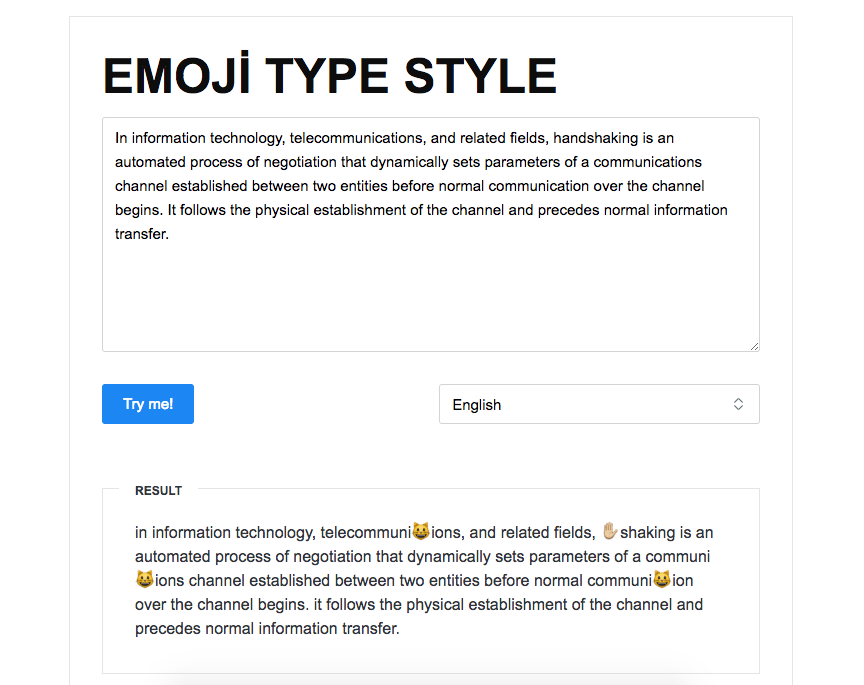

# Emoji Type Style

The writing helps to express as emoji. It was created to create short, funny scripts.

Emoji Type Style - [Demo](http://tolgahanuzun.com/emoji/index.html)

### Used in the project
- Emoji packages *node-modules/emoji* 
- Kube was used as the CSS framework and it was pulled over CDN.

## Screenshot

## Todo
- ~~Solved upper-lower case letters problem.~~
- ~~New Data added~~
- ~~Language options added.~~

### Contributers
- Tolgahan Üzün - [@tolgahanuzun](https://github.com/tolgahanuzun) 
- Abdullah Uğraşkan - [@apoStyLEE](https://github.com/apoStyLEE) 
- Anıl İyidoğan - [@aniliyidogan](https://github.com/aniliyidogan) 